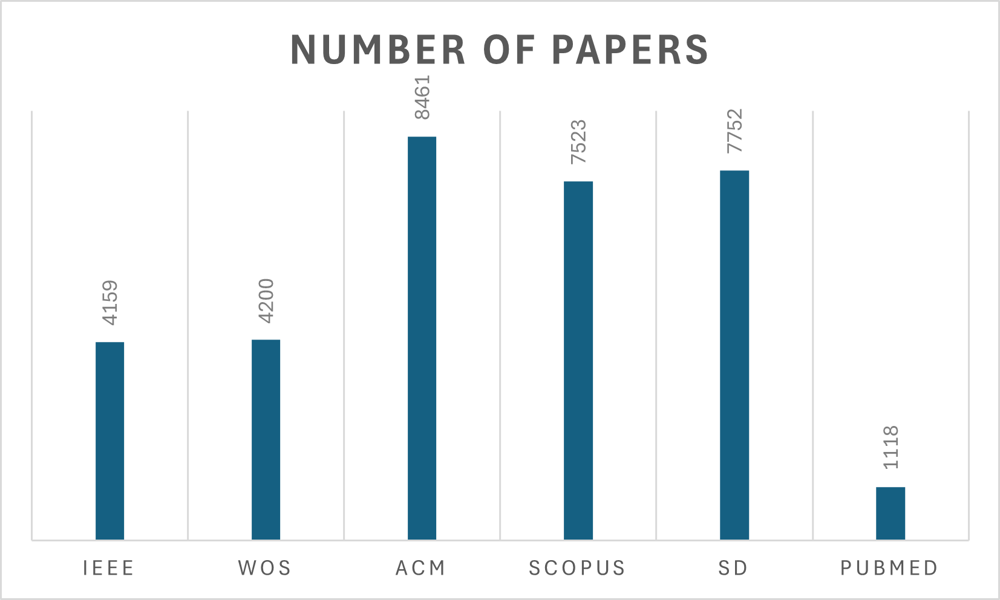

# Systematic-Review
This review examines the role of Human-Robot and Child-Robot Interaction in early childhood education, with a focus on language acquisition. It explores how social robots process multimodal inputs (speech, gaze, gestures) to enhance communication, sustain engagement, and adapt to children’s needs. Key topics include adaptive learning systems, emotion detection, real-time interaction, and ethical considerations such as privacy and emotional well-being. By highlighting current advancements and challenges, this paper provides insights for improving robot-assisted language learning and child development.

## Pre-Query Analysis Report

This report presents an analysis of the queries used in the systematic review process. Each query was assessed for its ability to capture relevant studies, and based on this evaluation, the most comprehensive query was identified. 

| Query ID | Query Key Search | Papers Retrieved (IEEE Xplore) |
|----------|------------------|--------------------------------|
| Q1       | (“Human-Robot Interaction” OR “Child-Robot Interaction”) AND (“Robots”) AND (“Education” OR “School” OR “Learning”) AND (“Child” OR “Childhood” OR “Children”) | 358 |
| Q2       | (“Human-Robot Interaction” OR “Child-Robot Interaction”) AND (“Robots” OR “Social Robots”) AND (“Community” OR “Social”) AND (“Education” OR “School” OR “Learning”) | 1425 |
| Q3       | (“Human-Robot Interaction” OR “Child-Robot Interaction”) AND (“Robots” OR “Social Robots”) AND (“Community” OR “Social”) AND (“Education” OR “School” OR “Learning” OR “Caregiver” OR “Child Directed Speech”) | 1480 |
| Q4       | ((“Human-Robot Interaction” OR “Child-Robot Interaction” OR “Interaction”) AND (“Robot”) AND (“Child* OR “Community” OR “Social”) AND (“Education” OR “School” OR “Learning” OR “Caregiver” OR “Child-Directed Speech” OR “Talker”)) | 2596 |
| Q5       | ((“Human-Robot Interaction” OR “Child-Robot Interaction” OR “Interaction”) AND (“Robot”) AND (“Child*”) AND (“Education” OR “School” OR “Learning” OR “Caregiver” OR “Child-Directed Speech” OR “Talker”)) | 604 |
| Q6       | ((“Human-Robot Interaction” OR “Child-Robot Interaction” OR “Interaction”) AND (“Robot*”) AND (“Child*” OR “Community*” OR “Social*”) AND (“Education*” OR “School*” OR “Learn*” OR “Caregiver” OR “Child-Directed Speech” OR “Speech Interaction” OR “Talker”)) | 3186 |
| Q7       | ((“Human-Robot Interaction” OR “Child-Robot Interaction” OR “Interaction”) AND (“Robot*”) AND (“Child*”) AND (“Education*” OR “School*” OR “Learn*” OR “Caregiver” OR “Child-Directed Speech” OR “Speech Interaction” OR “Talker”)) | 690 |
| Q8       | ((“Human-Robot” OR “Child-Robot”) AND (“Robot”) AND (“Child*” OR “Communit*” OR “Social”) AND (“Education” OR “School” OR “Learn*” OR “Caregiver” OR “Teach*” OR “Child-Directed” OR “Speech” OR “Language” OR “Communication”)) | 2410 |
| Q9       | (((“Human-Robot” OR “Child-Robot” OR “Interaction”) AND (“Robot*”) AND (“Child*” OR “Communit*” OR “Social*”) AND (“Education*” OR “School*” OR “Learn*” OR “Caregiver” OR “Child-Directed Speech” OR “Language” OR “Communication” OR “Teach*” OR “Talker”)) ) | 4065 |
| Q10      | ((“Human-Robot” OR “Child-Robot” OR “Interaction”) AND (“Robot*”) AND (“Child*” OR “Communit*” OR “Social*”) AND (“Education*” OR “School*” OR “Learn*” OR “Caregiver” OR “Child-Directed” OR "Speech" OR “Languag*” OR “Communicat*” OR “Teach*” OR “Talker”)) | **4165** |

The analysis showed that Query Q10 retrieved the largest number of papers (4,165), including all papers captured by the previous nine queries (Q1–Q9) from IEEE Xplore. As a result, Q10 is considered the most comprehensive query for this systematic review and will be used as the final query to ensure that no relevant papers are overlooked.

# Research Paper Retrieval Statistics

## Overview
This section presents data on the number of research papers retrieved using **Q10** across six major academic databases: IEEE, Web of Science (WoS), ACM, Scopus, ScienceDirect (SD), and PubMed. The data covers the years **2015 to 2025**, showing the trend of research paper retrieval over time. The primary objective of this study is to analyze the availability and growth of research articles in various academic databases, providing insights into publication trends in recent years. The table below displays the number of research papers retrieved from each database for the years  **2015 to 2025**. The second table provides a summary of the total number of papers retrieved from each database.

| Year  | IEEE | WoS  | ACM  | Scopus | SD   | PubMed | Total  |
|-------|------|------|------|--------|------|--------|--------|
| 2015  | 233  | 210  | 369  | 447    | 352  | 37     |        |
| 2016  | 294  | 264  | 481  | 431    | 348  | 43     |        |
| 2017  | 309  | 313  | 514  | 545    | 404  | 51     |        |
| 2018  | 350  | 373  | 644  | 577    | 448  | 70     |        |
| 2019  | 401  | 408  | 553  | 648    | 560  | 75     |        |
| 2020  | 373  | 477  | 830  | 1023   | 749  | 108    |        |
| 2021  | 424  | 506  | 924  | 1021   | 925  | 188    |        |
| 2022  | 596  | 550  | 1062 | 859    | 988  | 205    |        |
| 2023  | 563  | 483  | 1258 | 893    | 1109 | 172    |        |
| 2024  | 606  | 592  | 1743 | 1026   | 1430 | 157    |        |
| 2025  | 10   | 24   | 83   | 53     | 439  | 12     |        |
| **Total** | **4159** | **4200** | **8461** | **7523** | **7752** | **1118** | **33213** |

| Engine Search | IEEE | WoS  | ACM  | Scopus | SD   | PubMed | Total  |
|--------------|------|------|------|--------|------|--------|--------|
| Number of Papers | 4159 | 4200 | 8461 | 7523 | 7752 | 1118 | 33213 |

This dataset represents the **retrieval of research papers** using Q10 from **six different academic databases**. The numbers indicate how many papers were found in each database for a given year. Below is an illustration summarizing the research retrieval statistics.

## Key Observations:
1. **Overall Growth**:  
   - The number of retrieved papers increased significantly from 2015 to 2024.
   - The highest number of papers retrieved was in **2024**, showing a peak in research publications.
2. **Database Differences**:  
   - **ACM** has the highest number of retrieved papers (**8,461 total**).
   - **PubMed** has the lowest count (**1,118 total**), likely due to its focus on medical and life sciences.
3. **Decrease in 2025**:  
   - A sudden drop in 2025 may indicate incomplete data collection or a shift in research trends.

The data highlights the increasing volume of academic research over the years, particularly in **ACM, Scopus, and SD** databases. The significant rise in papers retrieved suggests that more research is being published and indexed across multiple databases. These trends can be useful for researchers, librarians, and institutions to understand the **growth of academic publishing** and the **importance of choosing the right database** for literature searches.

