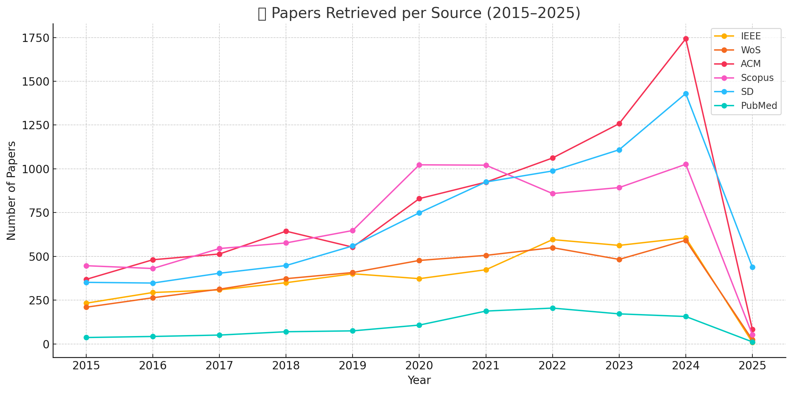

# 📚 README.md

## 🤖 Systematic Review: Child-Robot Interaction

This systematic review examines methodologies and impacts of Child-Robot Interaction (CRI) across various domains, focusing particularly on language acquisition, adaptive learning systems, multimodal communication (speech, gaze, gestures), and emotional and social development. It highlights how social robots enhance engagement, learning outcomes, and developmental progress, along with addressing ethical concerns such as privacy and emotional well-being.

## 🔍 Comprehensive Search Query

The extensive query used to retrieve relevant studies from academic databases:

```
(("Child-Robot" OR "Interaction") AND ("Robot*") AND ("Child*" OR "Communit*" OR "Social*") AND ("Education*" OR "School*" OR "Learn*" OR "Caregiver" OR "Child-Directed" OR "Speech" OR "Languag*" OR "Communicat*" OR "Teach*" OR "Talker"))
```

This query retrieved **4,165 papers** from IEEE Xplore.

## 📈 Paper Retrieval Statistics (2015-2025)

Retrieval statistics from IEEE, Web of Science (WoS), ACM, Scopus, ScienceDirect (SD), and PubMed:

| Year      | IEEE | WoS  | ACM  | Scopus | SD   | PubMed | Total     |
| --------- | ---- | ---- | ---- | ------ | ---- | ------ | --------- |
| 2015      | 233  | 210  | 369  | 447    | 352  | 37     | 1648      |
| 2016      | 294  | 264  | 481  | 431    | 348  | 43     | 1861      |
| 2017      | 309  | 313  | 514  | 545    | 404  | 51     | 2136      |
| 2018      | 350  | 373  | 644  | 577    | 448  | 70     | 2462      |
| 2019      | 401  | 408  | 553  | 648    | 560  | 75     | 2645      |
| 2020      | 373  | 477  | 830  | 1023   | 749  | 108    | 3560      |
| 2021      | 424  | 506  | 924  | 1021   | 925  | 188    | 3988      |
| 2022      | 596  | 550  | 1062 | 859    | 988  | 205    | 4260      |
| 2023      | 563  | 483  | 1258 | 893    | 1109 | 172    | 4478      |
| 2024      | 606  | 592  | 1743 | 1026   | 1430 | 157    | 5554      |
| 2025      | 10   | 24   | 83   | 53     | 439  | 12     | 621       |
| **Total** | 4159 | 4200 | 8461 | 7523   | 7752 | 1118   | **33213** |



### 🔑 Key Insights

* 📊 **Growth Trend**: Publication volume increased significantly (2015-2024), peaking notably in 2024.
* 🎯 **Database Insights**: ACM consistently had the highest paper retrieval; PubMed the lowest due to domain specificity.
* ⚠️ **Data Anomaly**: The drop in 2025 suggests incomplete data or a shift in research interests.

## ✂️ Duplicate and Irrelevant Paper Removal

Duplicate entries and non-empirical papers were excluded:

| Source           | IEEE | WoS  | SD   | Scopus | ACM  | PubMed | Total     |
| ---------------- | ---- | ---- | ---- | ------ | ---- | ------ | --------- |
| Remaining Papers | 3954 | 2852 | 2267 | 7131   | 5672 | 423    | **22299** |

## 🔎 Initial Relevance Filtering

Screening abstracts, titles, and keywords against specific inclusion and exclusion criteria:

### ✅ Inclusion Criteria

* Empirical studies focusing on child-robot interactions.
* Educational and developmental outcomes (language, social skills).
* Measurable engagement and cognitive development outcomes.
* Typically developing child populations.

### ❌ Exclusion Criteria

* Non-empirical papers (reviews, theoretical frameworks).
* Studies lacking clear developmental or educational outcomes.
* General robotic interactions not focused specifically on children.
* Studies involving neurodivergent populations or unrelated contexts.

Initial screening identified **6412 relevant papers**:

| Source   | IEEE | WoS  | SD   | Scopus | ACM  | PubMed | Total |
| -------- | ---- | ---- | ---- | ------ | ---- | ------ | ----- |
| Relevant | 1407 | 1222 | 1501 | 865    | 1331 | 86     | 6412  |

## 🎯 Refined Filtering Process

Focused on studies explicitly addressing typically developing children and their language and communication development:

| Source   | IEEE | WoS | SD  | Scopus | ACM | PubMed | Total    |
| -------- | ---- | --- | --- | ------ | --- | ------ | -------- |
| Relevant | 604  | 576 | 477 | 370    | 429 | 46     | **2502** |

## 📌 Final Paper Set

After full-text screening, **211 empirical studies** were selected, addressing:

* Educational settings and language acquisition.
* Communication skills in typically developing children.
* Quantifiable developmental outcomes.

This collection represents carefully curated, high-quality research evidence for effective child-robot interaction across diverse domains.
